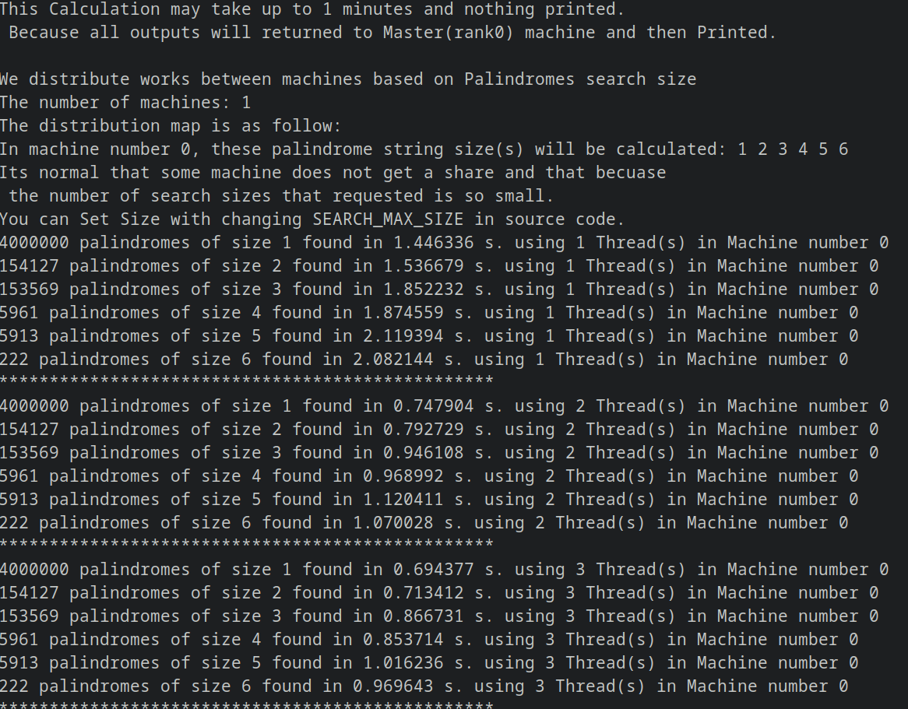

# About  
 This project is about to show the use case of MPI and OpenMP with calculating a heavy intensive CPU task. 
The task defined is to count the number of palindrome strings in a matrix. There are three implementation of this task:  
    
1 - MPI implementation with C++.    
2 - OpenMP implementation with C++.  

# How To Run

The Makefile provided for compiling:
```
$ make
```

You can run the binary files with:
```
$ ./mpi
$ ./openmp
```
    
# Sample Run
    
MPI sample Run:  
    
  
    
OpenMP sample Run:  
    

    

